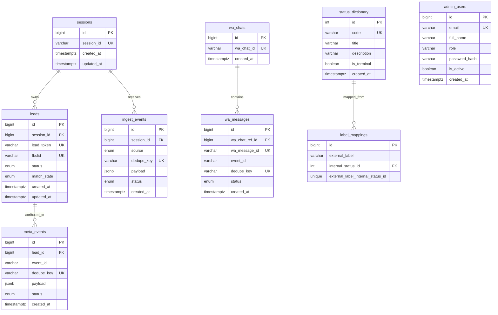

# Database schema pack

## ORM choice and migration pipeline

Selected ORM: **Prisma**.

### Pipeline
1. Configure `DATABASE_URL` for PostgreSQL.
2. Apply migrations in CI/prod: `npm run db:migrate:deploy`.
3. Check migration state: `npm run db:migrate:status`.
4. Seed dictionaries/admin users: `npm run db:seed`.

Migration source of truth is in `prisma/migrations/*`.

---

## ER diagram

---

## Field dictionary

### `sessions`
- `id` — technical PK.
- `session_id` — stable external session identifier, unique, indexed.
- `created_at`, `updated_at` — audit timestamps.

### `leads`
- `id` — PK.
- `session_id` — FK → `sessions.id`, required, indexed.
- `lead_token` — external lead token, unique, indexed.
- `fbclid` — Facebook click id, optional unique, indexed.
- `status` — enum `event_status` (`pending|processed|failed`), indexed.
- `match_state` — enum `match_state` (`unmatched|partial|matched|rejected`), indexed.
- `created_at`, `updated_at` — timestamps, indexed by `created_at`.

### `ingest_events`
- `id` — PK.
- `session_id` — FK → `sessions.id`, required, indexed.
- `source` — enum `ingest_source` (`webhook|api|csv_import|retry_job`).
- `dedupe_key` — unique idempotency key for ingest pipeline, indexed via unique constraint.
- `payload` — raw JSON payload.
- `status` — enum `event_status`, indexed.
- `created_at` — timestamp, indexed.

### `meta_events`
- `id` — PK.
- `lead_id` — nullable FK → `leads.id`.
- `event_id` — external Meta event identifier, indexed.
- `dedupe_key` — unique idempotency key for Meta pipeline, indexed via unique constraint.
- `payload` — raw JSON payload.
- `status` — enum `event_status`, indexed.
- `created_at` — timestamp, indexed.

### `wa_chats`
- `id` — PK.
- `wa_chat_id` — external WhatsApp chat id, unique, indexed.
- `created_at` — timestamp, indexed.

### `wa_messages`
- `id` — PK.
- `wa_chat_ref_id` — FK → `wa_chats.id`, required.
- `wa_message_id` — external WhatsApp message id, unique, indexed.
- `event_id` — related event id, indexed.
- `status` — enum `event_status`, indexed.
- `dedupe_key` — unique dedupe key for message replay protection.
- `created_at` — timestamp, indexed.

### `admin_users`
- `id` — PK.
- `email` — unique login/email.
- `full_name` — display name.
- `role` — role code.
- `password_hash` — credential hash.
- `is_active` — active flag.
- `created_at` — timestamp, indexed.

### `status_dictionary`
- `id` — PK.
- `code` — unique internal status code.
- `title`, `description` — business labels.
- `is_terminal` — finality flag.
- `created_at` — timestamp, indexed.

### `label_mappings`
- `id` — PK.
- `external_label` — external system label.
- `internal_status_id` — FK → `status_dictionary.id`.
- `unique(external_label, internal_status_id)` — prevents duplicate mappings.

---

## Mandatory indexes checklist

Implemented indexes/unique constraints for:
- `session_id`
- `lead_token`
- `fbclid`
- `wa_chat_id`
- `wa_message_id`
- `status`
- `event_id`
- `dedupe_key`
- `created_at`
- `match_state`

(Implemented in `prisma/schema.prisma` and `prisma/migrations/20260313170000_init/migration.sql`.)
